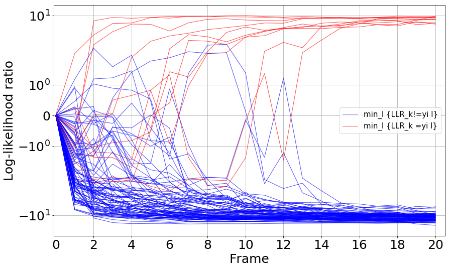

# SPRT-TANDEM tutorial

In this tutorial, we show you how to train & evaluate the __SPRT-TANDEM__ algorithm on your sequential dataset. The tutorial is designed to work on [Google Colab](https://colab.research.google.com/).

## Quickstart

1. Click [this link](https://colab.research.google.com/github/Akinori-F-Ebihara/SPRT-TANDEM-tutorial/blob/main/notebooks/SPRT_TANDEM_tutorial.ipynb) to open the following notebook in Google Colab:  
   [``./notebooks/SPRT_TANDEM_tutorial.ipynb``](https://github.com/Akinori-F-Ebihara/SPRT-TANDEM-tutorial/blob/main/notebooks/SPRT_TANDEM_tutorial.ipynb)
3. Follow the instruction in the notebook!

# SPRT-TANDEM: what is it?

## Introduction

__SPRT-TANDEM__ is a sequential density ratio estimation algorithm originally proposed in the paper, ["Sequential Density Ratio Estimation for Simultaneous Optimization of Speed and Accuracy"](https://openreview.net/forum?id=Rhsu5qD36cL) [ICLR2021 Spotlight]. The __SPRT-TANDEM__ sequentially estimates log-likelihood ratios of two hypotheses, or classes, for fast and accurate sequential data classification.

The original paper [1] can be found [here:](https://arxiv.org/abs/2006.05587)
The tensorflow implementation of the SPRT-TANDEM can be found [here:](https://github.com/TaikiMiyagawa/SPRT-TANDEM)

While the technical details are left to the paper, we provide a casual introduction to our algorithm below.

## Requirements

This article is best read with the Chrome browser with [MathJax Plugin for GitHub](https://chrome.google.com/webstore/detail/mathjax-plugin-for-github/ioemnmodlmafdkllaclgeombjnmnbima?hl=en).

## Problem setting

Imagine you have a sequential data,

\begin{equation}
X^{(1,T)} := \lbrace x^{(1)}, x^{(2)}, ..., x^{(t)}, ..., x^{(T)} \rbrace,
\end{equation}

where $x^{(t)}$ is a data sample, such as a video frame, an audio signal, a neural firing rate, etc. The sequential data $X^{(1,T)}$ has an associated binary label $y\in\lbrace1,0\rbrace$ that indicates a class to which the sequential data belong. Your task is to correctly estimate the class label $y$, with a minimal number of data samples possible (say, $k < n$ samples). Generally speaking, there is a trade-off between speed (i.e., small data samples) and accuracy (i.e., a correct estimate of the label): using fewer samples tend to increase the misclassification rate, while highly accurate classification requires more data samples. Thus, it is a non-trivial problem.

## Sequential Probability Ratio Test

One algorithm that provides a solution to the above tradeoff problem is the Sequential Probability Ratio Test, or SPRT, which was originally invented by Abraham Wald [5, 6]. The SPRT calculates the log-likelihood ratio (LLR) of two competing hypotheses (i.e., $y=1$ v.s. $y=0$) and updates the LLR every time a new sample is acquired until the LLR reaches one of the two thresholds for alternative hypotheses.

<div align="center">

</div>

As the schematic figure above shows, for data that is easy to classify, the SPRT outputs an answer taking a few samples, whereas, for difficult data, the SPRT takes in numerous samples in order to make a ``careful'' decision. Importantly, Wald and his colleagues proved that when sequential data are sampled from independently and identically distributed (i.i.d.) data, SPRT can minimize the required number of samples to achieve the desired upper-bounds of false positive and false negative rates comparably to the Neyman-Pearson test, known as the most powerful likelihood test [4, 6].

Thus, we would like to use the SPRT whenever possible for solving the sequential classification problem. Below we will see how the SPRT can be applied to a real problem.

## Example 1: coin flipping

Let's start with a toy example to get the hang of the SPRT.

<div align="center">

</div>

You have two coins, but one of them is a skewed coin that has uneven probabilities of generating head or tail when it is flipped:

\begin{equation}
\text{Unbiased coin: } y=0 \\;
\begin{cases}
p(x^{(t)} | y=0) = \frac{1}{2} & \text{if } x^{(t)} = x_{head} \newline
p(x^{(t)} | y=0) = \frac{1}{2} & \text{if } x^{(t)} = x_{tail}
\end{cases}
\end{equation}

\begin{equation}
\text{Biased coin: } y=1 \\;
\begin{cases}
p(x^{(t)}| y=1) = \frac{1}{3} & \text{if } x^{(t)} = x_{head} \newline
p(x^{(t)}| y=1) = \frac{2}{3} & \text{if } x^{(t)} = x_{tail}
\end{cases}
\end{equation}

You do not know which one is biased: the true label $y$ of the coins are unknown. Now, you want to experiment with the two coins to make a guess on the labels. Thus, the two hypotheses are:

\begin{align}
\begin{split}
&H_0: y=0 \text{   (It is the unbiased coin.)} \newline
&H_1: y=1 \text{   (It is the biased coin.)}
\end{split}
\end{align}

Flipping each of them ten times yields the following results. Note that we assume each flipping trial is independent.

The first coin:
\begin{align}
\begin{split}
X_{1}^{(1, 10)} = \lbrace x_{head}, x_{tail}, x_{tail}, x_{head}, x_{tail}, x_{tail}, x_{tail}, x_{tail}, x_{tail}, x_{head} \rbrace
\end{split}
\end{align}

The second coin:
\begin{align}
\begin{split}
X_{2}^{(1, 10)} = \lbrace x_{head}, x_{tail}, x_{head}, x_{tail}, x_{tail}, x_{head}, x_{head}, x_{tail}, x_{head}, x_{head} \rbrace
\end{split}
\end{align}

In order to use the SPRT for testing hypotheses, you need to calculate the LLR. Luckily, in this example you can calculate the exact log-likelihood ratio for $X_{1}^{(1, 10)} $ and $X_{2}^{(1, 10)}$ easily, because (i) you already know the probabilities of being head or tail, and (ii) each flipping trial can be handled as independent:

\begin{align}
\mathrm{LLR}(X_1^{(1,10)})
:= & \log \left(
\frac{p(X_{1}^{(1,10)} | y=1)}
{p(X_{1}^{(1,10)} | y=0)}
\right) \nonumber \newline
= & \sum_{t=1}^{10} \log \frac{p( x_1^{(t)} | y=1)} {p( x_1^{(t)} | y=0)} \nonumber \newline
= & \log \left( \frac{ \frac{1}{3} } { \frac{1}{2} } \right) + \log \left(\frac{ \frac{2}{3} } { \frac{1}{2} } \right) + \log\left( \frac{ \frac{2}{3} } { \frac{1}{2} } \right) + \log\left( \frac{ \frac{1}{3} } { \frac{1}{2} } \right) + \log\left(\frac{ \frac{2}{3} } { \frac{1}{2} } \right) \nonumber \newline
+ &\log\left(\frac{ \frac{2}{3} } { \frac{1}{2} } \right) + \log\left(\frac{ \frac{2}{3} } { \frac{1}{2} } \right) + \log\left(\frac{ \frac{2}{3} } { \frac{1}{2} } \right) + \log\left(\frac{ \frac{2}{3} } { \frac{1}{2} } \right) + \log\left(\frac{ \frac{1}{3} } { \frac{1}{2} }\right) \nonumber \newline
\approx & 0.80
\end{align}

\begin{align}
\mathrm{LLR}(X_2^{(1,10)})
:= & \log \left(
\frac{p(X_{1}^{(1,10)} | y=1)}
{p(X_{1}^{(1,10)} | y=0)}
\right) \nonumber \newline
= & \sum_{t=1}^{10} \log \frac{p( x_2^{(t)} | y=1)} {p( x_2^{(t)} | y=0)} \nonumber \newline
= & \log \left( \frac{ \frac{1}{3} } { \frac{1}{2} } \right) + \log \left(\frac{ \frac{2}{3} } { \frac{1}{2} } \right) + \log\left( \frac{ \frac{1}{3} } { \frac{1}{2} } \right) + \log\left( \frac{ \frac{2}{3} } { \frac{1}{2} } \right) + \log\left(\frac{ \frac{2}{3} } { \frac{1}{2} } \right) \nonumber \newline
+ &\log\left(\frac{ \frac{1}{3} } { \frac{1}{2} } \right) + \log\left(\frac{ \frac{1}{3} } { \frac{1}{2} } \right) + \log\left(\frac{ \frac{2}{3} } { \frac{1}{2} } \right) + \log\left(\frac{ \frac{1}{3} } { \frac{1}{2} } \right) + \log\left(\frac{ \frac{1}{3} } { \frac{1}{2} }\right) \nonumber \newline
\approx & -1.28
\end{align}

$\mathrm{LLR}(X_1^{(1,10)}) $ has a positive value, while $\mathrm{LLR}(X_2^{(1,10)})$ has a negative value. Thus, the first coin is likely to be the biased coin, while the second coin is unbiased. The figure below shows the cumulative sum of the LLR that is updated at each acquisition of a new data sample.

<div align="center">

</div>

If we set two thresholds $\pm 1.0$, $X_1^{(1,10)}$ and $X_2^{(1,10)}$ are correctly classified at the 9th and 10th frame, respectively.

## Example 2: face spoofing detection

Next, let's consider a more realistic application: face spoofing detection. Face spoofing detection is one of the biometrics tasks classifying a facial image into a live face class, or a spoof face class (e.g., a facial photo, a face displayed on a screen, a face mask).

In this example, you are presented with a series of facial image to choose one of the two hypotheses,

\begin{align}
\begin{split}
&H_0: y=0 \text{   (It is a live face.)} \newline
&H_1: y=1 \text{   (It is a spoof face.)}
\end{split}
\end{align}

Now let's see an example video.

$X_1^{(1,6)}$:

<div align="center">

</div>

$X_2^{(1,6)}$:

<div align="center">

</div>

The next step is to calculate the LLR to test the hypotheses. But _how_? Here, you are confronting with two problems executing the SPRT. First, unlike the coin-flipping example, __you do not know the probability__ conditioned with a class label (i.e., likelihood) of each sample. Second, the video frames are __highly correlated__, and the i.i.d. assumption of the original SPRT no longer holds. These two problems, which are partain to real-world scenarios, hamper executing the SPRT.

## SPRT-TANDEM for the likelihood estimation

So what should we do? Here comes the __SPRT-TANDEM__ algorithm. We use two kinds of density ratio estimation algorithms, ratio matching approach, and probabilistic classification approach, to let a deep neural network estimate the likelihood ratio. To control a correlation length that is considered, we propose the TANDEM formula:

\begin{align}
&\ \log \left(
\frac{p(x^{(1)},x^{(2)}, ..., x^{(t)}| y=1)}{p(x^{(1)},x^{(2)}, ..., x^{(t)}| y=0)}
\right)\nonumber \newline
= &\sum_{s=N+1}^{t} \log \left(
\frac{
p(y=1| x^{(s-N)}, ...,x^{(s)})
}{
p(y=0| x^{(s-N)}, ...,x^{(s)})
}
\right) - \sum_{s=N+2}^{t} \log \left(
\frac{
p(y=1| x^{(s-N)}, ...,x^{(s-1)})
}{
p(y=0| x^{(s-N)}, ...,x^{(s-1)})
}
\right) \nonumber \newline
& - \log\left( \frac{p(y=1)}{p(y=0)} \right)
\end{align}

For the derivation, see Appendix C of the original paper [1]. Our proposed neural network is trained to explicitly calculate the TANDEM formula to provide the sequential likelihood ratio estimation. We trained the neural network with live and spoof faces like Example 2 (to be precise, we used an infrared channel of facial images) so that the network can sequentially estimate the LLR from the data series. Below is the calculatd likelihood trajectories of Example 2.

<div align="center">

</div>

The conceptual figure of the proposed neural network is presented below. At the training phase, we adopted a novel loss function, LLLR, to minimize Kullback-Leibler Divergence [3] between the estimated and the true LLRs. For the detail, see Section 4 of the original paper [1].

<div align="center">

</div>

## SPRT as an algorithm of the brain

The SPRT algorithm makes an early decision for an easy data series, while it takes time to make a decision on a difficult data. This is quite in line with our daily mental process - the more difficult a problem is, the longer time we require for decision making. Indeed, the SPRT seems to be the best algorithm explaining neural activities in the primate brain. Kira et al. [2] found that neurons in the part of the primate brain called the lateral intraparietal cortex (LIP) showed neural activities reminiscent of the SPRT; when a monkey sequentially collecs random pieces of evidence to make a binary choice, LIP neurons show activities proportional to the LLR. Note that the presented stimuli are distributed i.i.d.; thus, it remains an open question if the brain uses the SPRT-TANDEM for correlated data or uses some other algorithm.

## Citation

Please cite the original papers if you find our work is useful:

```
# ICLR2021
@inproceedings{SPRT-TANDEM,
  title={Sequential Density Ratio Estimation for Simultaneous Optimization of Speed and Accuracy},
  author={Akinori F Ebihara and Taiki Miyagawa and Kazuyuki Sakurai and Hitoshi Imaoka},
  booktitle={International Conference on Learning Representations},
  year={2021},
  url={https://openreview.net/forum?id=Rhsu5qD36cL}
}

# ICML2021
@inproceedings{MSPRT-TANDEM,
  title = 	 {The Power of Log-Sum-Exp: Sequential Density Ratio Matrix Estimation for Speed-Accuracy Optimization},
  author =       {Miyagawa, Taiki and Ebihara, Akinori F},
  booktitle = 	 {Proceedings of the 38th International Conference on Machine Learning},
  pages = 	 {7792--7804},
  year = 	 {2021},
  url = 	 {http://proceedings.mlr.press/v139/miyagawa21a.html}
}

```

## Acknowledgements

The author thanks Hirofumi Nakayama and Yoshihiko Ebihara for valuable comments to improve the article.

## References

[1] A. F. Ebihara, T. Miyagawa, K. Sakurai, and H. Imaoka. Deep neural networks for the sequential probability ratiotest on non-i.i.d. data series, arXiv, 2020

[2] S. Kira, T. Yang, and M. N. Shadlen. A neural implementation of wald’s sequential probability rato test. Neuron, 85(4):861–873, Feb. 2015.

[3] S. Kullback and R. A. Leibler. On information and sufficiency.Ann. Math. Statist., 22(1):79–86, 03 1951.

[4] A. Tartakovsky,  I. Nikiforov,  and M. Basseville.Sequential Analysis: Hypothesis Testing and ChangepointDetection. Chapman & Hall/CRC, 1st edition, 2014.

[5] A. Wald. Sequential tests of statistical hypotheses. Ann. Math. Statist., 16(2):117–186, 06 1945.

[6] A. Wald.Sequential Analysis. John Wiley and Sons, 1st edition, 1947.

## Requirements

- Python 3.5
- TensorFlow 2.0.0
- CUDA 10.0
- cuDNN 7.6.0
- Jupyter Notebook 4.4.0
- Optuna 0.14.0

## Quick Start

1. Create NMNIST-H and NMNSIT-100f.

   1-0. `cd ./data-directory`

   1-1. `python make_nmnist-h.py` with `train_or_test` = "train"

   1-2. `python make_nmnist-h.py` with `train_or_test` = "test"

   1-3. `python make_nmnist-100f.py` with `train_or_test` = "train"

   1-4. `python make_nmnist-100f.py` with `train_or_test` = "test"
2. Extract features.
   2-1. `save_feature_tfrecords.ipynb` with `save_data` = "train" (NMNSIT-H)

   2-1. `save_feature_tfrecords.ipynb` with `save_data` = "test" (NMNSIT-H)

   2-1. `save_feature_tfrecords.ipynb` with `save_data` = "train" (NMNSIT-100f)

   2-1. `save_feature_tfrecords.ipynb` with `save_data` = "test" (NMNSIT-100f)
3. Plot the speed-accuracy tradeoff (SAT) curve with `plot_SATC_casual.ipynb`.

## Result Images

### Speed-accuracy tradeoff (SAT) curve on NMNIST-H


### MSPRT-TANDEM vs. NP test on NMNIST-H


### SAT curve with standard deviation of hitting times on NMNIST-H


### Trajectories of log-likelihood ratio of NMNIST-H



## What You Can Do

1. Create and extract the bottleneck features of NMNIST-H and NMNIST-100f as TFRecord files.
   - Relevant files and directories:
     - /data-directory/make_nmnist-h.py
     - /data-directory/make_nmnist-100f.py
     - /data-directory/trained_models
     - save_feature_tfrecords.ipynb
2. Create and extract the bottleneck features of the clipped UCF101 and HMDB51 used in our paper as TFRecord files.
   - Relevant directories:
     - /data-directory/create_UCF101
     - /data-directory/create_HMDB51
3. Train a ResNet on NMNIST-H or NMNSIT-100f as a feature extractor.
   - Relevant files:
     - train_fe_nmnist-h.py
     - /configs/config_fe_nmnist-h.yaml
     - show_trial_params.ipynb
4. Train an LSTM on NMNIST-H, NMNIST-100f, UCF101, or HMDB51 as a temporal integrator.
   - Relevant files:
     - train_X_Y.py (X = ti or dre. Y = nmnist-h or UCF101.)
     - trains_X_Y.sh
     - /configs/config_X_Y.yaml
     - show_trial_params.ipynb
5. Plot SAT curves.
   - Relevant files:
     - plot_SATC_casual.ipynb
     - plot_SATC_casual_lite.ipynb

## Directories

- `/configs`
  - Config files for training codes.
- `/datasets`
  - TFRecords loader and preprocessing methods.
- `/models`
  - Backbone ResNet, LSTM, and loss functions. The LSEL is here (/models/losses.py).
- `/utils`
  - MSPRT algorithm and miscellaneous stuff.
- `/data-directory`
  - The train logs will be stored here.
  - Creation files of NMNIST-H, NMNSIT-100f, UCF101, and HMDB51.
- `/images`
  - For README file.

## Citation

___Please cite our paper if you use the whole or a part of our codes.___

```
ICML
@InProceedings{MSPRT-TANDEM,
  title = 	 {The Power of Log-Sum-Exp: Sequential Density Ratio Matrix Estimation for Speed-Accuracy Optimization},
  author =       {Miyagawa, Taiki and Ebihara, Akinori F},
  booktitle = 	 {Proceedings of the 38th International Conference on Machine Learning},
  pages = 	 {7792--7804},
  year = 	 {2021},
  editor = 	 {Meila, Marina and Zhang, Tong},
  volume = 	 {139},
  series = 	 {Proceedings of Machine Learning Research},
  month = 	 {18--24 Jul},
  publisher =    {PMLR},
  pdf = 	 {http://proceedings.mlr.press/v139/miyagawa21a/miyagawa21a.pdf},
  url = 	 {http://proceedings.mlr.press/v139/miyagawa21a.html},
  abstract = 	 {We propose a model for multiclass classification of time series to make a prediction as early and as accurate as possible. The matrix sequential probability ratio test (MSPRT) is known to be asymptotically optimal for this setting, but contains a critical assumption that hinders broad real-world applications; the MSPRT requires the underlying probability density. To address this problem, we propose to solve density ratio matrix estimation (DRME), a novel type of density ratio estimation that consists of estimating matrices of multiple density ratios with constraints and thus is more challenging than the conventional density ratio estimation. We propose a log-sum-exp-type loss function (LSEL) for solving DRME and prove the following: (i) the LSEL provides the true density ratio matrix as the sample size of the training set increases (consistency); (ii) it assigns larger gradients to harder classes (hard class weighting effect); and (iii) it provides discriminative scores even on class-imbalanced datasets (guess-aversion). Our overall architecture for early classification, MSPRT-TANDEM, statistically significantly outperforms baseline models on four datasets including action recognition, especially in the early stage of sequential observations. Our code and datasets are publicly available.}
}

(arXiv; cite the ICML version.)
@article{MSPRT-TANDEM,
  title={The Power of Log-Sum-Exp: Sequential Density Ratio Matrix Estimation for Speed-Accuracy Optimization},
  author={Miyagawa, Taiki and Ebihara, Akinori F},
  journal={arXiv preprint arXiv:2105.13636},
  year={2021}
}
```
